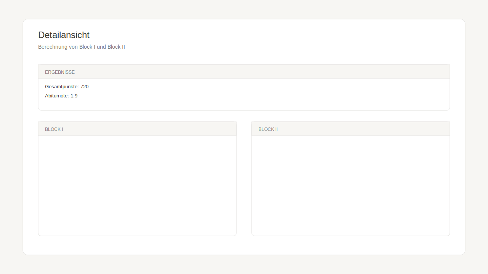

# Abitur-Planer Blankenese

Eine moderne Web-App zur Prognose der Abiturnote für Schüler*innen des Gymnasiums Blankenese in Hamburg.


## 🎯 Features

### ✨ Kernfunktionen
- **📚 Profilwahl**: Auswahl aus 5 Profilen (Humanities, Kosmopolit, Kultur!, Netzwerk Erde, Wissenschaft in Bewegung)
- **🎓 Kernfach-Konfiguration**: Festlegung von zwei Kernfächern auf erhöhtem Niveau (eA) und einem auf grundlegendem Niveau (gA)
- **🧩 Weitere Fächer**: Ergänzung aller weiteren belegten Fächer für S1-S4 (Auswahl gilt für alle Semester)
- **📝 Prüfungsfächer-Auswahl**: Intelligente Validierung aller Hamburg-Abitur-Constraints
- **📊 Noten-Tabelle**: Notion-Style Tabelle mit vier Semestern + Abiturprüfungskarte für die Punkte
- **🤖 Auto-Prognose**: Fehlende Semesterwerte werden beim Rechnen mit gerundetem Durchschnitt gefüllt
- **🧮 Optimierungsalgorithmus**: Automatische Auswahl der besten 32-40 Noten für Block I
- **📈 Abiturberechnung**: Ergebnis-Karte mit Block I, Block II, Gesamtpunkten und Abiturnote
- **💾 Speichern & Laden**: Persistierung mit InstantDB (Login über Magic Code)

### 🎨 Besondere Features
- **Echtzeit-Validierung**: Sofortiges Feedback bei Regelverstößen
- **Interaktive Szenarien**: Was-wäre-wenn Analyse durch anpassbare Prüfungsnoten
- **Detaillierte Aufschlüsselung**: Detailansicht der Berechnungsschritte
- **Optimale Fächerauswahl**: Intelligenter Greedy-Algorithmus für beste Notenauswahl
- **Responsive Design**: Funktioniert auf Desktop, Tablet und Mobile

## 🖼️ Screenshots




## 🚀 Tech Stack

- **Frontend**: React 19 + Vite 7
- **Styling**: Tailwind CSS 4
- **Backend**: InstantDB (real-time database)
- **Icons**: Lucide React
- **Build Tool**: Vite mit HMR
- **Package Manager**: npm

## 📋 Entwicklungsstand

### ✅ Fertig (Version 1.0)
- [x] Projekt-Setup mit Vite + React + Tailwind
- [x] InstantDB Integration & Schema
- [x] Profildaten aus Wegweiser übertragen
- [x] Profil-Auswahl UI (alle 5 Profile)
- [x] Kernfach-Auswahl UI mit Validierung
- [x] Prüfungsfächer-Auswahl mit vollständiger Constraint-Validierung
- [x] Noten-Matrix für S1-S4 mit Auto-Prognose
- [x] Block I Berechnung mit Optimierungsalgorithmus
- [x] Block II Berechnung (Abiturprüfungen)
- [x] Gesamtqualifikation und Notentabelle
- [x] Warnungen bei Regelverstößen
- [x] Ergebnis-Dashboard mit Visualisierung
- [x] Persistierung mit InstantDB (Speichern & Laden)
- [x] Login via Magic Code für persönliche Berechnungen
- [x] Notion-Style Notentabelle mit Abiturprüfungskarte

### 📅 Geplante Erweiterungen (Version 2.0)

#### Speicher- und Datenverwaltung
- [ ] **Auto-Save Funktion**: Automatisches Speichern bei Änderungen
- [ ] **Versionierung**: Änderungshistorie für gespeicherte Berechnungen
- [ ] **Export/Import**: JSON-Download und Upload für Offline-Backup
- [ ] **Datenmigration**: Update-Mechanismus für Schemaänderungen

#### Erweiterte Analyse-Features
- [ ] **Vergleichs-Modus**: Zwei oder mehr Szenarien nebeneinander vergleichen
- [ ] **Statistiken und Trend-Analysen**: Visualisierung der Notenentwicklung über Semester
- [ ] **Was-wäre-wenn-Rechner**: Interaktive Simulation verschiedener Notenszenarien
- [ ] **Zielvorgaben**: Berechnung benötigter Punkte für Wunschnote

#### Sharing und Kollaboration
- [ ] **Teilbare Links**: Öffentliche oder geschützte Links für Prognosen
- [ ] **PDF-Export**: Professionell formatierter Download der Abiturberechnung
- [ ] **Screenshot-Funktion**: Direkte Bildexporte der Ergebnisse

#### Fachliche Erweiterungen
- [ ] **Wahlbereich-Konfiguration**: Integration zusätzlicher Wahlfächer
- [ ] **Besondere Lernleistung (BLL)**: Integration der BLL in die Berechnung
- [ ] **Sprachdiplome**: Berücksichtigung von Sprachzertifikaten

#### UI/UX Verbesserungen
- [ ] **Dark Mode**: Dunkles Farbschema für Augen-schonendes Arbeiten
- [ ] **Onboarding-Tutorial**: Geführte Tour für neue Nutzer
- [ ] **Keyboard Shortcuts**: Schnellzugriff über Tastaturkürzel
- [ ] **Progressive Web App (PWA)**: Installation als native App
- [ ] **Offline-Modus**: Funktionsfähigkeit ohne Internetverbindung

#### Validierung und Feedback
- [ ] **Erweiterte Validierung**: Zusätzliche Constraints aus Prüfungsordnung
- [ ] **Tipps und Empfehlungen**: KI-basierte Vorschläge zur Notenverbesserung
- [ ] **Warnsystem**: Frühzeitige Warnungen bei Risiko des Nichtbestehens

## 🏃 Entwicklung starten

```bash
# Dependencies installieren
npm install

# Umgebungsvariable setzen (.env Datei bereits vorhanden)
# VITE_INSTANT_APP_ID ist bereits konfiguriert

# Dev-Server starten
npm run dev
# → öffnet http://localhost:5173

# Build für Production
npm run build

# Production Build lokal testen
npm run preview
```

## 🚀 Deployment (Netlify)

1. **Build command**: `npm run build`
2. **Publish directory**: `dist`
3. **Environment variables**:
   - `VITE_INSTANT_APP_ID` (InstantDB App-ID aus der `.env`)
4. **Node-Version**: 18+ empfohlen (Vite 7)
5. **Optional**: Wenn die App unter einem Sub-Pfad liegt, `base` in `vite.config.js` setzen

## 📖 Abitur-Regelwerk

Die App basiert auf dem "Wegweiser zur Profiloberstufe" des Gymnasiums Blankenese und implementiert das **Hamburger Abitur-Regelwerk** vollständig:

### Block I (Semesternoten) - max. 600 Punkte
- **Anzahl**: Mindestens 32, höchstens 40 Semesterergebnisse
- **Pflichteinbringung**:
  - Alle 4 Abiturprüfungsfächer (je 4 Semester)
  - Alle 3 Kernfächer (je 4 Semester)
  - **Musisches Fach**: Genau ein Fach aus Bildende Kunst/Musik/Theater wird automatisch gewählt, alle 4 Semester werden eingebracht (beste Durchschnittsnote)
  - **Musikpraktische Fächer** (Orchester/Chor/Popchor/Bigband): keine Pflicht; max. 3 Noten und nur zusätzlich zu den 32 Mindestnoten
  - Mind. ein Fach aus: Kunst/Musik/Theater
  - Mind. ein Fach aus: Geschichte/Geographie/PGW
  - Mind. ein Fach aus: Physik/Chemie/Biologie
- **Doppelzählung**:
  - Profilgebendes Prüfungsfach zählt doppelt
  - Schriftliches eA-Kernfach zählt doppelt
- **Formel**: `E = P × 40 / S`
  - E = Ergebnis (max. 600)
  - P = Summe aller Punkte (inkl. Doppelzählungen)
  - S = Anzahl der Noten (inkl. Doppelzählungen)
- **Bestehen**: Mindestens 200 Punkte, max. 20% unter 5 Punkten

### Block II (Abiturprüfungen) - max. 300 Punkte
- **Prüfungen**: 3 schriftlich + 1 mündlich
- **Gewichtung**: Jede Prüfung zählt 5-fach
- **Formel**: `E = 5 × (PF1 + PF2 + PF3 + PF4)`
- **Bestehen**: Mindestens 100 Punkte, in zwei Fächern (davon eins eA) mind. 5 Punkte

### Gesamtqualifikation - max. 900 Punkte
- **Berechnung**: Block I + Block II
- **Notentabelle**:
  - 823-900 = 1,0
  - 300 = 4,0 (Mindestpunktzahl zum Bestehen)
- **Bestehen**: Mindestens 300 Punkte gesamt

## 🎯 Verwendung

### Beispiel-Workflow

1. **Profil wählen**: z.B. "Netzwerk Erde"
2. **Kernfächer festlegen**:
   - Deutsch (eA)
   - Mathematik (eA)
   - Englisch (gA)
3. **Weitere Fächer für S1-S4 ergänzen**:
   - Alle zusätzlichen belegten Fächer wählen (Auswahl gilt für alle Semester)
   - Die Auswahl kann später jederzeit geändert werden
4. **Prüfungsfächer wählen**:
   - Biologie (schriftlich, eA) - profilgebend
   - Deutsch (schriftlich, eA)
   - Mathematik (schriftlich, gA)
   - Geschichte (mündlich, gA)
5. **Noten eingeben**:
   - Semesternoten in der Tabelle eintragen
   - Prüfungsnoten in der Abiturprüfungskarte ergänzen
   - Änderungen sind jederzeit möglich
6. **Ergebnis berechnen**:
   - Berechnung starten, sobald alle Anforderungen erfüllt sind
   - Bei Änderungen per Button neu berechnen
   - Ergebnis zeigt optimale Fächerauswahl, Abiturnote und Punktzahl
7. **Details ansehen & speichern**:
   - Detailansicht für die Berechnungslogik öffnen
   - Login oben rechts und Berechnung speichern

### Speichern & Laden

Die App nutzt **InstantDB** für die Persistierung deiner Berechnungen:

- **Login**: Oben rechts anmelden (Magic Code per E-Mail)
- **Speichern**: Klick auf "Speichern", Namen vergeben und Berechnung sichern
- **Laden**: Klick auf "Laden", um gespeicherte Berechnungen zu öffnen
- **Verwalten**: In der Laden-Ansicht kannst du Berechnungen umbenennen oder löschen
- **Mehrere Szenarien**: Speichere verschiedene Fächerkombinationen und vergleiche sie

Die Daten werden automatisch mit der InstantDB-Cloud synchronisiert und sind dauerhaft verfügbar.

## 🔧 Projektstruktur

```
.
├── src/
│   ├── components/
│   │   ├── AbiturWizard/
│   │   │   ├── index.jsx                # Wizard-Steuerung (Schritte 1-4)
│   │   │   ├── ProfilePicker.jsx        # Profilwahl
│   │   │   ├── CoreSubjects.jsx         # Kernfächer
│   │   │   ├── AdditionalSubjects.jsx   # Weitere Fächer
│   │   │   ├── ExamSubjects.jsx         # Prüfungsfächer
│   │   │   └── SemesterMatrix.jsx       # Noten-Tabelle + Ergebnis/Abiturkarten
│   │   ├── AuthButton.jsx               # Login via InstantDB Magic Code
│   │   ├── ResultsDashboard.jsx         # Detailansicht der Berechnung
│   │   ├── SaveLoadManager.jsx          # Speichern & Laden Dialoge
│   │   └── ui/SubjectTag.jsx            # Notion-Style Tags
│   ├── data/
│   │   ├── profiles.js                  # Profildefinitionen & Konstanten
│   │   └── examConstraints.js           # Validierungsregeln
│   ├── utils/
│   │   ├── abiturCalculation.js         # Berechnungs-Engine
│   │   └── persistence.js               # Speichern/Laden Funktionen
│   ├── lib/
│   │   └── instantdb.js                 # InstantDB Setup
│   ├── App.jsx                          # Haupt-App mit Workflow
│   └── main.jsx                         # React Entry Point
└── public/
    └── screenshots/                     # README Screenshots
```

## 🧮 Algorithmus-Details

### Block I Optimierung (Greedy-Algorithmus)

```javascript
1. Trenne Pflicht- von optionalen Noten
2. Sortiere optionale Noten absteigend
3. Fülle bis Minimum 32 Noten auf
4. Berechne E = P × 40 / S
5. Prüfe iterativ ob Noten 33-40 E verbessern
6. Stoppe wenn weiteres Hinzufügen E verschlechtert
```

### Doppelgewichtung
- Profilgebendes Prüfungsfach: Erhöht P und S jeweils um Notenwert
- Schriftliches eA-Kernfach: Erhöht P und S jeweils um Notenwert
- Beide Faktoren werden in Zähler (P) UND Nenner (S) berücksichtigt

## ⚠️ Wichtige Hinweise

- Die App dient zur **Prognose** und ersetzt nicht die offizielle Berechnung durch die Schule
- Alle Berechnungen basieren auf dem Wegweiser 2023 des Gymnasiums Blankenese
- Bei Änderungen der Prüfungsordnung muss die App aktualisiert werden
- Für Deployments (z.B. Netlify) muss `VITE_INSTANT_APP_ID` als Environment Variable gesetzt sein

## 🤝 Beitragen

Dieses Projekt wurde mit Claude Code und ChatGPT Codex entwickelt. Verbesserungsvorschläge sind willkommen!

## 📄 Lizenz

MIT License - Copyright (c) 2025

## 👨‍💻 Entwicklung

Entwickelt mit **ChatGPT Codex** und **Claude Code** (Claude Sonnet 4.5) für das Gymnasium Blankenese, Hamburg.

### Credits
- **Regelwerk**: Gymnasium Blankenese "Wegweiser zur Profiloberstufe"
- **Algorithmus-Konzept**: Gemini (Google)
- **Implementierung**: ChatGPT Codex (OpenAI) und Claude Code (Anthropic)
- **Tech Stack**: React, Vite, Tailwind CSS, InstantDB

---

**Hinweis**: Diese App wurde entwickelt, um Schüler*innen bei der Planung ihres Abiturs zu unterstützen. Die Berechnungen sind nach bestem Wissen korrekt, aber die offizielle Notenberechnung erfolgt durch die Schule.
